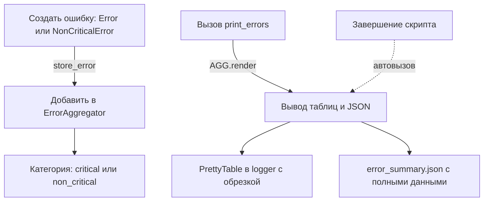

# Обработка Ошибок в Custom Python Modules

## Обзор

Модули `errors.py`, `error_aggregator.py` и `error_handling.py` предоставляют систему для создания, агрегации и вывода ошибок в скриптах, интегрирующихся с NetBox, PRTG и другими системами. Система ориентирована на разделение критических и некритических ошибок, их централизованное хранение и читаемый вывод в таблицах.

### Цель Компонентов
- **errors.py**: Определяет классы исключений `Error` (критические) и `NonCriticalError` (некритические). Поддерживает цветной вывод в консоль и хранение ошибок.
- **error_aggregator.py**: Singleton-класс `ErrorAggregator` для сбора ошибок по категориям ("critical" и "non_critical"). Автоматически выводит сводку в таблицы и JSON при завершении скрипта (через `atexit`).
- **error_handling.py**: Функция `print_errors()` для явного вывода накопленных ошибок.

Система обеспечивает:
- Автоматическую агрегацию ошибок без ручного управления списками.
- Обрезку длинных сообщений для читаемости таблиц (лимит: 200 символов, с суффиксом "... [truncated]").
- Обратную совместимость с устаревшими API (с предупреждениями).

### Workflow Диаграмма



- **Поток**: Ошибки создаются как исключения, автоматически сохраняются в aggregator. Вывод происходит через `print_errors()` или автоматически при выходе.
- **Trade-offs**: Автоматический вывод (atexit) удобен для скриптов, но может быть отключён через `os.getenv('DISABLE_ERROR_AGGREGATOR')`. JSON-дамп полезен для пост-анализа, но увеличивает использование диска (файл ~1-10 КБ на запуск).

## Создание и Хранение Ошибок

### Критическая Ошибка (Error)
Используйте для ошибок, которые должны прервать выполнение или требуют немедленного внимания.

```python
from custom_modules.errors import Error

try:
    # Код, который может вызвать ошибку
    raise ValueError("Invalid configuration")
except ValueError as e:
    raise Error(str(e), ip="10.10.250.2")  # Сохранит ошибку с IP устройства
```

- **Цель**: Печатает красное сообщение в консоль и добавляет в категорию "critical".
- **Действие**: Скрипт продолжит выполнение (не прерывает), но ошибка агрегируется для вывода.

### Некритическая Ошибка (NonCriticalError)
Используйте для предупреждений, которые не критичны (например, пропущенные VLAN).

```python
from custom_modules.errors import NonCriticalError

NonCriticalError(
    "Missing VLANs: ['130', '640']",
    ip="10.10.250.2",
    calling_function="check_vlans"
)
```

- **Цель**: Печатает жёлтое сообщение в консоль и добавляет в категорию "non_critical".
- **Действие**: Не прерывает выполнение; подходит для сценариев, где ошибка игнорируема.

### Trade-offs в Создании Ошибок
- **С IP или без**: Укажите `ip` для привязки ошибки к устройству (полезно в таблицах). Без `ip` ошибка просто печатается, но не агрегируется.
- **Опции**: `calling_function` в `NonCriticalError` добавляет префикс (e.g., "check_vlans failed: ...").
- **Производительность**: Минимальный overhead; хранение в словаре O(1).

## Агрегация и Вывод Ошибок

Ошибки собираются в `ErrorAggregator` (singleton). Доступ через `AGG = ErrorAggregator()`.

### Явный Вывод Ошибок
Вызовите в конце скрипта для вывода таблиц и JSON.

```python
from custom_modules.error_handling import print_errors

# ... ваш код ...
print_errors()  # Выводит таблицы в logger и создаёт error_summary.json
```

- **Что происходит**:
  - Логгирует "The work is completed".
  - Вызывает `AGG.render()`: таблицы с ошибками (критические — через `logger.error`, некритические — через `logger.warning`).
  - Создаёт `error_summary.json` с полными (необрезанными) ошибками.

Пример вывода таблицы:
```
===== WORKFLOW SUMMARY =====
+--------+-------+
| Metric | Value |
+--------+-------+
+--------+-------+

NON_CRITICAL ERRORS:
+-------------+------------------------------------------+
| Device      | Non_Critical Error                       |
+-------------+------------------------------------------+
| 10.10.250.2 | Missing VLANs: ['130', '640']... [truncated] |
+-------------+------------------------------------------+
```

### Автоматический Вывод
- Через `atexit`: `render()` вызывается при завершении скрипта, если не был вызван вручную.
- Отключение: Установите переменную окружения `DISABLE_ERROR_AGGREGATOR=1`.

### Доступ к Ошибкам Программно
Для кастомной обработки (e.g., в `main.py` для email-уведомлений).

```python
from custom_modules.error_aggregator import ErrorAggregator

AGG = ErrorAggregator()
critical_errors = AGG.get_errors("critical")  # dict {ip: message}
non_critical_errors = AGG.get_errors("non_critical")  # dict {ip: message}
```

## Обработка Длинных Сообщений
- Автоматическая обрезка: Сообщения > 200 символов укорачиваются с "... [truncated]".
- Полные сообщения: Логируются в `logger.debug` (если обрезано) и сохраняются в `error_summary.json`.
- **Trade-offs**: Улучшает читаемость таблиц, но требует проверки логов/JSON для деталей. Лимит не конфигурируем (фиксирован для простоты).

## Устаревшие API (Deprecated)
Старые списки `Error.error_messages` и `NonCriticalError.error_messages` поддерживаются для совместимости, но выдают предупреждение в логах.

```python
from custom_modules.errors import Error

for err in Error.error_messages:  # Выдаст предупреждение в logger.warning
    print(err)
```

- **Предупреждение**: "DEPRECATED: Error.error_messages is deprecated and will be removed in version 2.0. Use ErrorAggregator().get_errors('critical') instead."
- **Миграция**: Замените на доступ через `ErrorAggregator` (см. выше). Удаление в версии 2.0.
- **Trade-offs**: Совместимость сохраняет старый код рабочим, но добавляет лёгкий overhead (дублирование данных).

## Примеры Использования
### Полный Пример Скрипта
```python
from custom_modules.errors import Error, NonCriticalError
from custom_modules.error_handling import print_errors

try:
    # Симуляция ошибок
    raise Error("Critical failure", ip="192.168.1.1")
except Error:
    NonCriticalError("Minor issue", ip="192.168.1.2")

print_errors()  # Выводит таблицы
```

- **Вывод**: Таблицы с ошибками; JSON-файл с деталями.

### Интеграция в Существующий Код
В `main.py` замените:
```python
for error in Error.error_messages:  # Старый способ (с предупреждением)
    # Обработка
```
На:
```python
from custom_modules.error_aggregator import ErrorAggregator
AGG = ErrorAggregator()
for ip, msg in AGG.get_errors("critical").items():  # Новый способ
    # Обработка
```

## Возможные Проблемы и Решения
- **Дублированный вывод**: Если `print_errors()` вызван, atexit не сработает (флаг `_already_rendered`).
- **Нет вывода**: Проверьте `DISABLE_ERROR_AGGREGATOR` или уровень лога (`logger.setLevel(logging.INFO)`).
- **Длинные сообщения**: Если нужно полные — читайте `error_summary.json` или настройте `logger.debug`.
- **Trade-offs**: Централизация упрощает, но требует миграции старого кода. Если ошибок много (>1000), таблицы могут быть большими — рассмотрите фильтрацию.